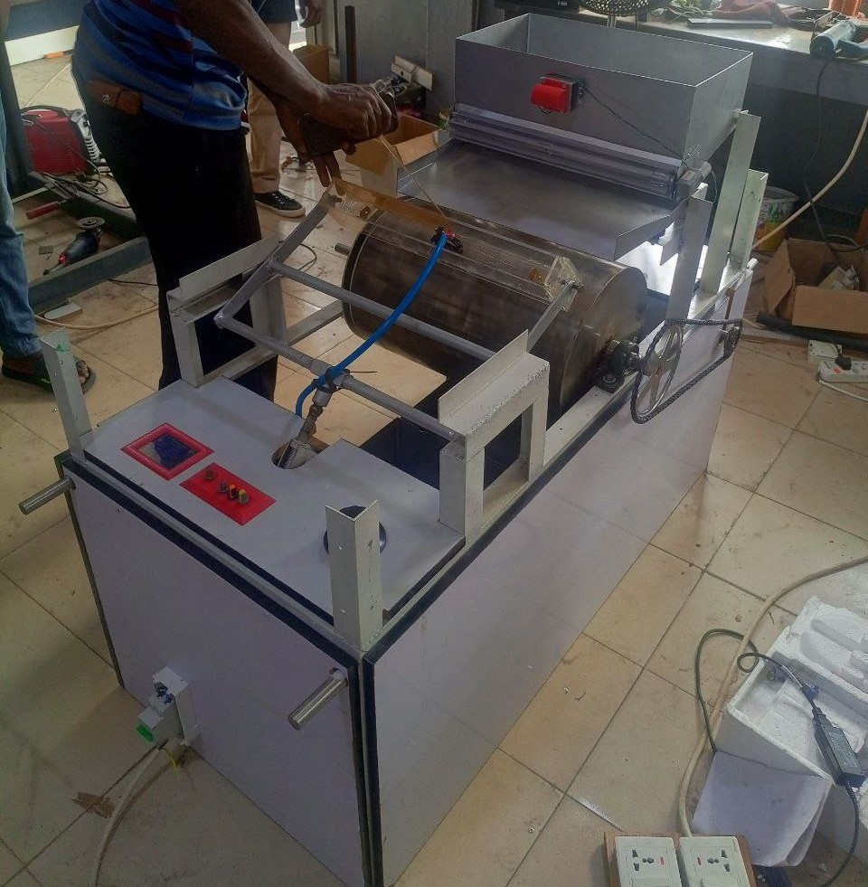

# Electrostatic Materials Separator — Embedded Control & High-Voltage System

A multidisciplinary industrial automation machine engineered to separate metallic and non-metallic particles using high-voltage electrostatic fields. This system integrates a master-slave dual-microcontroller architecture, custom mixed-signal conditioning circuits, high-power AC/DC switching, and a real-time graphical touchscreen interface.



---

## 📊 System Overview & Key Features

| Subsystem | Specification / Implementation | Technical Role |
| :--- | :--- | :--- |
| **Main System Controller** | **Arduino Mega 2560 Pro** | Central brain; executes UI rendering, Variac voltage sampling, and actuator PWM logic |
| **Dedicated Sensor Node** | **Arduino Pro Mini** | Dedicated edge processor; samples Hall sensor pulses and computes drum RPM[cite: 1] |
| **Inter-MCU Communication** | **SPI / UART Handshake**[cite: 1] | Real-time sensor telemetry transfer from slave (Pro Mini) to master (Mega)[cite: 1] |
| **High-Voltage Generation** | **Variac & Step-Up Transformer**[cite: 1] | Generates adjustable electrostatic field for metallic particle deflection[cite: 1] |
| **HV Signal Conditioning** | **Op-Amps, TIP31C, Passive Filters**[cite: 1] | Steps down and buffers transformer feedback for accurate microcontroller ADC monitoring[cite: 1] |
| **Interactive UI** | **3.5" ILI9488 TFT Touchscreen**[cite: 1] | Graphical display rendering live RPM, electrostatic voltage (kV), feeder rate, and vibration %[cite: 1] |
| **Actuation & Feeding** | **ESC, DC Motor, 2x Tray Vibrators**[cite: 1] | Regulates drum rotation speed and consistent feeder tray/hopper material flow (0–100%)[cite: 1] |

---

## 🛠️ Key Engineering Highlights

### 1. Master-Slave Dual-Microcontroller Architecture
* **Task Offloading:** To prevent display rendering loops on the **Arduino Mega 2560 Pro** from missing high-speed sensor interrupts, an **Arduino Pro Mini** was deployed as a dedicated sensor coprocessor[cite: 1].
* **RPM Acquisition:** The Pro Mini continuously captures pulses from a magnetic **Hall effect sensor** mounted on the rotating separation drum, calculates instantaneous revolutions per minute (RPM), and transmits structured telemetry packets to the main controller over **SPI**[cite: 1].

### 2. High-Voltage Signal Conditioning & Mixed-Signal PCB
* **Transformer Feedback Monitoring:** Designed and soldered an analog signal conditioning circuit using **operational amplifiers, capacitors, diodes, resistors, and TIP31C power transistors**[cite: 1].
* **Safe ADC Sampling:** This circuit conditions and scales the high-voltage output from the Variac/transformer stage into a safe, linear 0–5V analog range, allowing the Mega to monitor and display live electrostatic voltage (in kV) on the touchscreen[cite: 1, 2].
* **Power & Noise Isolation:** Implemented an **XL4015 DC-DC buck converter** to supply a clean 5V rail to the logic boards, isolating the low-voltage microcontrollers from electromagnetic noise generated by the industrial AC contactors and feeder vibrators[cite: 1].

### 3. Real-Time Graphical UI & Electromechanical Control
* **TFT Interface:** Programmed a graphical dashboard on an **ILI9488 TFT screen** to give operators real-time feedback on drum speed, feeder speed, electrostatic voltage, and vibration intensity[cite: 1].
* **Precision Material Flow:** Configured PWM control logic to independently drive an **Electronic Speed Controller (ESC)** for drum rotation and dual industrial vibrators on the feeder tray and hopper (adjustable from 0% to 100% intensity)[cite: 1].

---

## 📂 Repository Structure

```text
Electrostatic-Materials-Separator/
├── firmware/
│   ├── mega_main_controller/    # Arduino Mega 2560 Pro code (TFT UI, Actuators & Main Loop)
│   └── pro_mini_rpm_sensor/     # Arduino Pro Mini code (Hall Sensor Interrupts & SPI Transmit)
├── hardware/
│   ├── schematics/              # Signal conditioning schematic diagrams & PCB layouts
│   └── bom.md                   # Complete Bill of Materials (Electronics, HV & Mechanical)
└── docs/
    ├── machine_photos/          # Finished machine, wooden/glass casing, and TFT display
    └── assembly_and_wiring/     # Internal control wiring, terminal blocks, and mechanical frame
